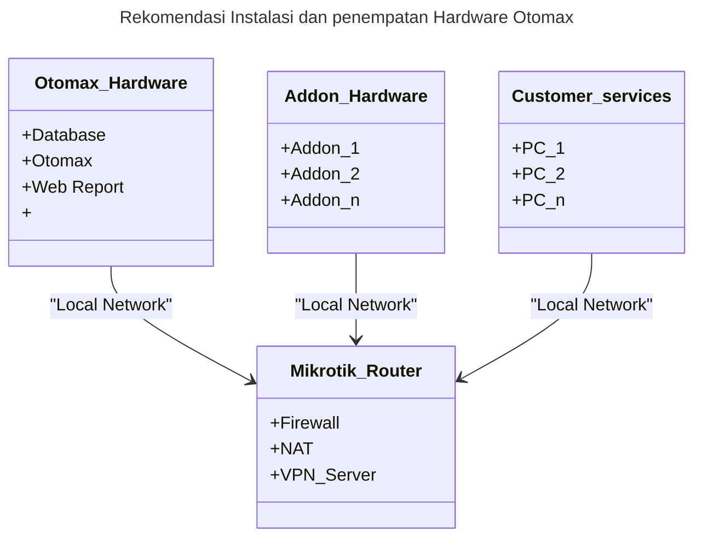
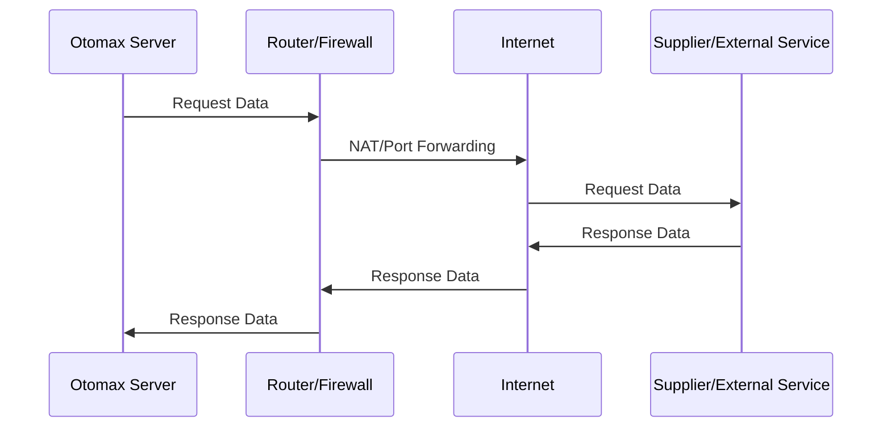
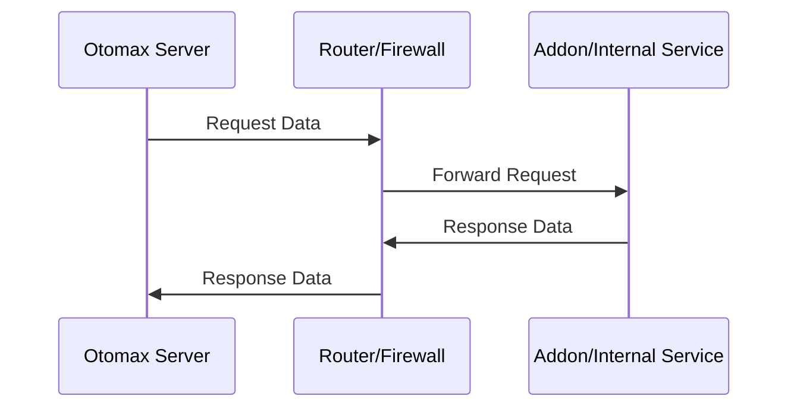
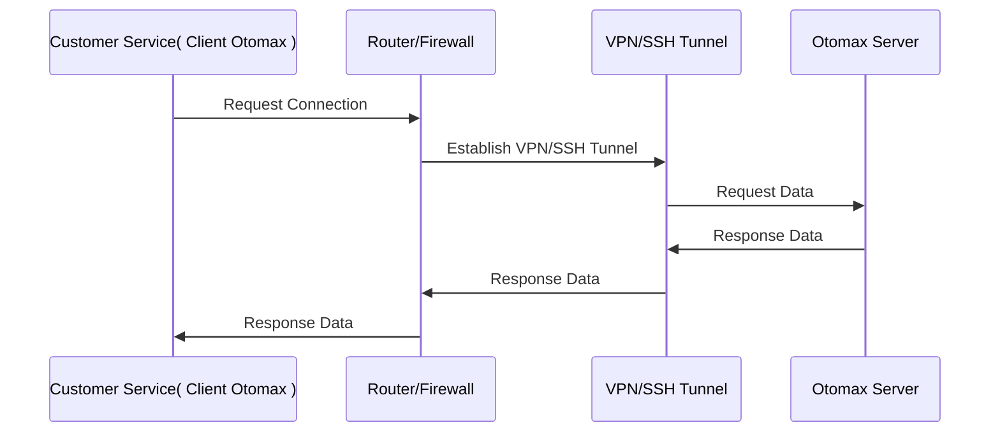

# Pengaturan Jaringan

!!! Note

    Sangat di sarankan memisahkan perangkat yang menginstall otomax dan addon addon nya dengan perangkat lain yang ada di jaringan yang sama, hal ini bertujuan untuk
    menjaga keamanan dan memudahkan audit atau investigasi ketika terjadi masalah secara infrastruktur, Jaringan, atau bahkan ketika terjadi fraud.

!!! warning

    Pastikan perangkat yang menginstall otomax dan addon addon nya terhubung ke jaringan yang sama (local network) dengan router/firewall yang di gunakan untuk mengatur koneksi internet, hal ini bertujuan untuk memudahkan konfigurasi port forwarding, firewall, dan monitoring traffic jaringan.

!!! danger

    pastikan server tetap untouchable.
    tidak boleh ada direct akses kecuali hanya admin / teknisi yang berwenang.

!!! catatan

    sebetul nya sah sah saja instalasi semua hal pada satu pc / server, tetapi audit , scallability, dan keamanan akan sangat berkurang.

## Rekomendasi Jaringan

> Sangat di sarankan membuat otomax dan addon addon nya menjadi localhost / local network dan jika butuh koneksi lintas jaringan gunakan VPN atau SSH Tunnel.
> Beberapa software yang bisa di gunakan untuk melakukan konfigurasi jaringan adalah `winbox` dan `openvpn`.

untuk menjaga kestabilan transaksi , atau pun traffic masuk dan keluar dari ke atau dari otomax, sangat di sarankan untuk menggunakan ip statis, beberapa kelebihan menggunakan ip statis adalah sebagai berikut:

- kita bisa memantau incomming dan outgoing traffic
- memudahkan konfigurasi port forwarding
- keamanan komunikasi dan data lebih terjaga

dengan menggunakan ip statis, kita tidak perlu lagi menggunakan Jabber atau menggunakan transport lain untuk menghubungkan otomax dengan addon addon nya atau dengan supplier.

## winbox

[Winbox](https://mikrotik.com/download/winbox) adalah software yang di gunakan untuk mengatur router mikrotik, dengan winbox kita bisa mengatur ip statis, port forwarding, firewall, dan lain lain.

## openvpn

[OpenVPN](https://openvpn.net/community-downloads/) adalah software yang di gunakan untuk membuat koneksi VPN, dengan openvpn kita bisa menghubungkan otomax dengan addon addon nya dalam jaringan yang aman dan terenkripsi, meskipun berada di jaringan yang berbeda.
dengan konfigurasi openvpn, maka server menjadi aksesible seolah olah berada dalam satu jaringan lokal, jadi akan sangat mudah ketika migrasi server dan menjaga koneksi tetap aman.

## ilustrasi jaringan

berikut adalah visualisasi apa yang di maksud dengan konfigurasi jaringan yang di rekomendasikan.
akan kita visualisasikan beberapa use case dan skenario jaringan yang di rekomendasikan.

### Otomax to Public Network

berikut sample skenario yang terjadi ketika kita akan melakukan **request ke supplier atau external service(di luar jaringan) dari otomax**.

pada skenario di atas, otomax server akan mengirimkan request data ke router/firewall, kemudian router/firewall akan melakukan NAT/Port Forwarding ke internet, lalu request data akan di teruskan ke supplier atau external service.
setelah supplier atau external service merespon, maka response data akan di teruskan kembali ke otomax server melalui router/firewall.

### Otomax to Addon/Internal Service

berikut sample skenario yang terjadi ketika otomax akan berkomunikasi dengan addon atau internal service.

Note:

- dengan membuat addon dan related service menjadi local network, maka addon tidak akan bisa di akses dari luar jaringan, sehingga keamanan komunikasi dan data lebih terjaga.
- bisa saja addon di berikan vpn atau ssh tunnel, jika memang di butuhkan akses lintas jaringan. tetapi demi menjaga kemanan, sangat di sarankan untuk tidak memberikan akses langsung ke addon.

### customer service to Otomax

berikut sample skenario yang terjadi ketika customer service akan mengakses otomax.

Note:

- dengan membuat customer service menjadi local network, maka customer service tidak akan bisa mengakses otomax secara langsung( hanya menggunakan aplikasi client otomax), sehingga keamanan data lebih terjaga. hanya admin atau teknisi yang berwenang yang bisa mengakses otomax server.
- sengan konfigurasi seperti ini , maka customer services, bisa ada di kantor / lokasi yang berbeda, dengan tetap memperhatikan keamanan , auditable, dan tetap dalam pengawasan admin / teknisi yang berwenang.

## Kesimpulan

dengan mengikuti rekomendasi pengaturan jaringan di atas, di harapkan otomax dan addon addon nya dapat beroperasi dengan lebih stabil, aman, dan efisien. penggunaan ip statis, port forwarding, serta VPN atau SSH Tunnel akan membantu menjaga koneksi tetap aman dan terjaga kualitasnya.

> detail setup winbox dan openvpn akan di bahas pada dokumentasi terpisah.
